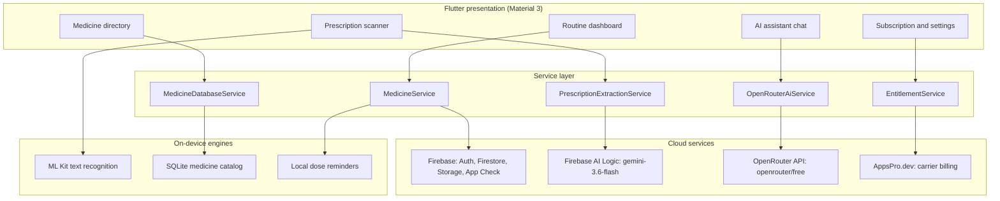
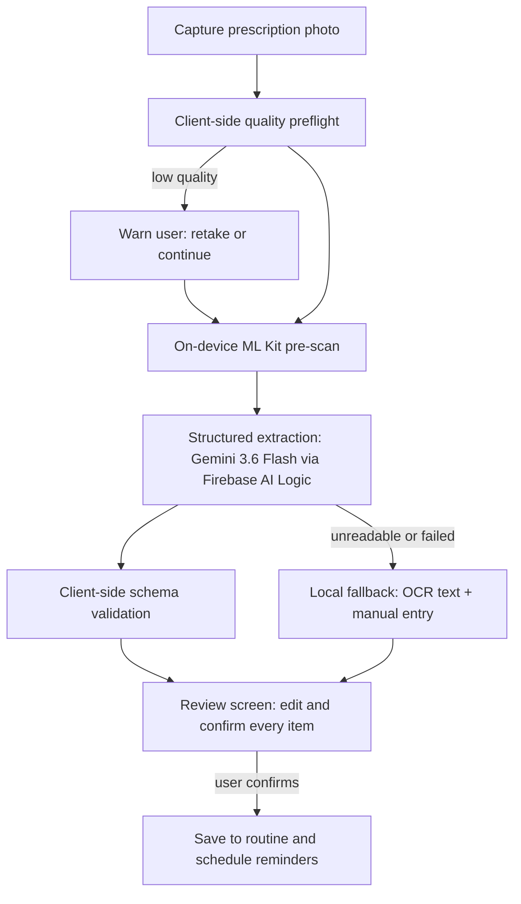

# MediTrack

[](https://flutter.dev)
[](https://dart.dev)
[](https://firebase.google.com)
[](https://developer.android.com)
[](LICENSE)

MediTrack is an Android medicine manager built for Bangladesh. Photograph a
prescription or a medicine box, confirm the extracted details, and the app takes
over from there: dose schedules with local alarms, stock and refill tracking, a
restock list, and a lookup for cheaper generic alternatives — with a context-aware
AI assistant that can answer questions about your routine and make changes on your
confirmation. The interface ships in English and Bangla.

## Features

**Medication management**

- Dose scheduling with configurable morning / noon / evening / night times and
  exact local alarms (no server round-trip needed for a reminder to fire).
- Stock tracking with automatic low-stock, refill-due, and expiry alerts.
- "Mark as taken" / "skip" dose logging plus a calendar view of adherence history.
- Family member profiles, filterable on the shared dashboard.
- A prescription vault for storing prescription photos with notes.
- A buy/restock list, populated automatically when stock crosses its threshold.

**AI and OCR**

- On-device box/strip scanning via ML Kit text recognition — offline and free.
- Prescription photo to a structured, confidence-scored medicine list using
  Gemini 3.6 Flash through Firebase AI Logic. Extracted items are always shown
  on a review screen and never saved without explicit confirmation.
- A context-aware AI assistant (OpenRouter) that can answer questions about the
  user's medications, look up Bangladesh prices, and add, update, or remove
  medicines and buy-list items through interactive confirmation cards.
- Voice dictation into medicine form fields using on-device speech recognition.

**Built for Bangladesh**

- A bundled offline SQLite catalog of registered Bangladeshi medicines with
  brand names, generics, strengths, manufacturers, and reference prices.
- Generic-alternative lookup sorted by price, with the reference-price
  disclaimer and last-updated date visible on results.
- A nearby pharmacy finder built on Google Maps deep links — no paid Places API.
- Prices formatted in Bangladeshi Taka (৳); full English/Bangla interface.

**Accounts and subscription**

- Firebase Authentication: Google Sign-In, email/password, and guest mode.
- A free tier with lifetime trial allowances: 1 prescription scan, 3 AI
  messages, and 3 price lookups.
- Premium (৳2.99/day) billed directly through Robi/Airtel carrier billing via
  AppsPro, with OTP verification. Entitlements are cached and re-verified
  server-side by `EntitlementService`.

## Architecture

MediTrack is a Flutter client organized as presentation → services → backends.
All Firestore access lives in service classes, pure business logic lives in
`lib/logic/`, and the carrier-billing integration is isolated under
`lib/features/bdapps/`. Firestore's offline persistence keeps the app usable
without connectivity.



### Prescription scanning pipeline

Prescription scanning is a two-stage hybrid designed to fail cheaply and never
save an unverified dose:



Why the pipeline is hybrid:

- **Offline pre-scan.** ML Kit runs on-device at zero cost, catches unusable
  captures before an API call is spent, and contributes recognized text lines
  as extra context to the model.
- **Schema-constrained extraction.** The Gemini call returns JSON matching a
  fixed response schema with per-item confidence — protected by App Check and
  authenticated sessions, with no client-side secret.
- **Human confirmation is mandatory.** Every extracted item lands on a review
  screen; low-confidence items are flagged and start unchecked. Nothing reaches
  the routine until the user confirms.

### AI assistant

The assistant has read access to the user's active routine, buy list, and the
medicine catalog, so its answers are grounded in the user's actual medications.
When the user asks for a change, it responds with a structured action card
(add, update, or remove a medicine or buy-list item) that executes only after
the user taps confirm. Requests go through OpenRouter's free router — with a
short list of verified vision-capable fallback models when an image is
attached — and through a sanitizing HTTP client that strips invalid JSON fields
before they reach the API.

## Tech stack

| Layer | Technology |
| :--- | :--- |
| Framework | Flutter 3.44+, Dart 3.12+ (sound null safety) |
| State management | `provider` — `ChangeNotifier` + `MultiProvider` |
| Backend | Firebase Auth, Cloud Firestore (offline persistence), Firebase Storage, App Check |
| Prescription OCR | `firebase_ai` — `gemini-3.6-flash` with a JSON response schema |
| AI assistant | `openrouter` package — `openrouter/free` router |
| On-device OCR | `google_mlkit_text_recognition` |
| Local catalog | `sqflite` — bundled SQLite database of Bangladesh medicines |
| Reminders | `flutter_local_notifications` + `timezone` + `flutter_timezone` |
| Voice input | `speech_to_text` (on-device) |
| Carrier billing | `dio` → AppsPro.dev REST API (OTP + subscription endpoints) |
| Design | Material 3, `google_fonts` (Poppins headings, Inter body) |

## Getting started

### Prerequisites

- Flutter 3.44 or newer, stable channel (the project's Dart constraint is
  `^3.12.2`), with the Android toolchain
- JDK 17
- An [OpenRouter](https://openrouter.ai) API key (the free tier works)
- A Firebase project — see [docs/firebase_setup_guide.md](docs/firebase_setup_guide.md)

### Installation

1. **Clone and fetch dependencies:**

   ```bash
   git clone https://github.com/helix-77/MediTrack.git
   cd MediTrack
   flutter pub get
   ```

2. **Create a `.env` file** in the project root (a template is in
   `.env.example`). The file is bundled as a Flutter asset via `flutter_dotenv`,
   so it must exist before the app builds:

   ```env
   # AI assistant (OpenRouter)
   OPENROUTER_API_KEY=your_openrouter_api_key

   # AppsPro / BD Apps carrier billing (only needed for the subscription flow)
   Base_URI=https://api.appspro.dev/api/v1
   APPS_PRO_SECRET_KEY=your_appspro_server_secret
   Publishable_Key=your_appspro_publishable_key
   App_ID=your_appspro_app_uuid
   Share_URL=your_appspro_checkout_url
   ```

   The app runs without the AppsPro values; only the carrier-billing flow needs
   them.

3. **Configure Firebase.** Run `flutterfire configure` against your Firebase
   project to generate `lib/firebase_options.dart` and
   `android/app/google-services.json`. These files are generated, never
   hand-edited. The setup walkthrough (including enabling the Firebase AI Logic
   backend) is in [docs/firebase_setup_guide.md](docs/firebase_setup_guide.md).

4. **Run the app:**

   ```bash
   flutter run
   ```

## Testing and code quality

```bash
# Static analysis — expected to pass with zero warnings
flutter analyze

# Unit, service, and widget tests
flutter test
```

Tests mirror the source layout: pure logic (validators, calculators, the OCR
parser) in `test/logic/`, service behavior in `test/services/`, network
middleware in `test/core/`, and widget/screen tests under `test/screens/`.

## Project structure

```
lib/
  main.dart            app bootstrap: Firebase, App Check, dotenv, providers
  config/              ApiConfig (models, base URLs, env access)
  core/network/        dio client and the OpenRouter sanitizing client
  theme/               colors, typography, app theme
  l10n/                AppStrings (English/Bangla) and locale notifier
  models/              Firestore document models (toMap / fromSnapshot)
  services/            one class per Firestore/Storage/Auth/AI concern
  logic/               pure, unit-testable validators and calculators
  features/bdapps/     AppsPro carrier-billing integration (own data layer)
  screens/             one file per screen
  widgets/             shared widgets
  utils/               small stateless helpers
test/                  mirrors lib/: logic, services, screens, core, models
firestore.rules        per-user Firestore scoping
storage.rules          per-user Storage scoping
assets/data/           bundled SQLite medicine catalog
docs/                  product spec, roadmap, task list, Firebase guide
```

## Security and privacy

- **Per-user data isolation.** `firestore.rules` and `storage.rules` restrict
  every `users/{uid}` path to its owner. The shared `medicineReference` price
  catalog is read-only from clients; only seed tooling with admin credentials
  can write it.
- **Attested API access.** Firebase App Check guards Firebase AI Logic calls
  and Firestore/Storage traffic.
- **Secrets stay out of the repo.** Keys live in the gitignored `.env`;
  Firebase configuration is generated by `flutterfire configure`.
- **No unverified saves.** OCR- and AI-extracted fields are never written
  without the user seeing and confirming them first.
- **Scope of medical claims.** MediTrack is an informational tracking tool. It
  does not check drug interactions or contraindications (deliberately out of
  scope — see spec Section 5.7) and is not a substitute for professional
  medical advice.

## Project status

**Implemented:** medication scheduling and reminders, on-device box OCR, the
Gemini prescription-extraction pipeline with review flow, the AI assistant with
confirmation-gated actions, the Bangladesh medicine catalog and generic-price
lookup, buy list, family profiles, prescription vault, calendar/routine view,
nearby pharmacy deep links, PDF export, English/Bangla UI, and the AppsPro
carrier-billing rail with freemium entitlements.

**In progress / planned:** completing the end-to-end subscription purchase
flow, refreshing the medicine price dataset, richer AI chat (new and archived
conversations), and the notification reliability audit (spec Section 5.13).
The full milestone-by-milestone plan — including the items that require
account, credential, or product decisions — is in
[docs/project-completion-roadmap.md](docs/project-completion-roadmap.md).

## Documentation

- [docs/medicine-manager-spec.md](docs/medicine-manager-spec.md) — product
  spec: architecture decisions, data model, feature specs, build phasing
- [docs/project-completion-roadmap.md](docs/project-completion-roadmap.md) —
  dependency-ordered completion plan with exit criteria
- [docs/task.md](docs/task.md) — current working list
- [docs/firebase_setup_guide.md](docs/firebase_setup_guide.md) — Firebase
  project setup walkthrough

## License

Licensed under the [PolyForm Noncommercial License 1.0.0](LICENSE).
Personal study, education, and noncommercial research are permitted;
commercial use, production deployment, or distribution through app stores
requires prior written permission.

Copyright (c) 2026 Md. Atik Mouhtasim.
