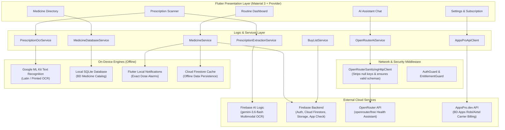
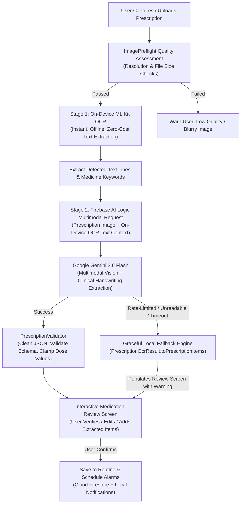
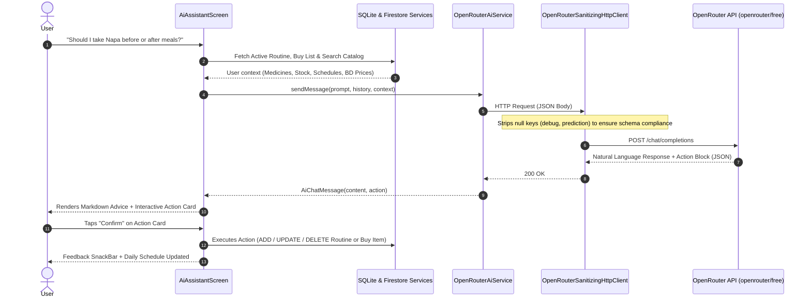

# MediTrack — Smart Medicine Manager & AI Health Companion

[](https://flutter.dev)
[](https://dart.dev)
[](https://firebase.google.com)
[](https://firebase.google.com/docs/ai-logic)
[](https://openrouter.ai)
[](LICENSE)

**MediTrack** is a production-grade Android medication management application tailored for Bangladesh. Built with Flutter, it empowers users to organize daily schedules, manage pill inventory, scan handwritten doctor prescriptions with a hybrid OCR/AI pipeline (Firebase AI Logic + ML Kit), converse with a context-aware AI health assistant (OpenRouter), lookup generic medicine alternatives, and receive timely dose alarms.

---

## 🌟 Key Features

- 💊 **Medication Scheduling & Smart Reminders**: Set custom daily dose times (morning, noon, evening, night) with exact alarms powered by `flutter_local_notifications` and `timezone`.
- 📷 **Hybrid AI Prescription Scanner**: Extracts doctor details, date, medicines, dosage forms, and schedules from handwritten or printed prescriptions using on-device ML Kit text recognition paired with **Firebase AI Logic (`gemini-3.6-flash`)**.
- 🤖 **Context-Aware AI Health Assistant**: Conversational medical guide powered by **OpenRouter** that can answer questions, query active medications, check Bangladesh generic prices, and perform conversational CRUD actions (add, update, or remove routine medications and buy items).
- 🇧🇩 **Bangladesh Medicine Catalog & Price Lookup**: Offline SQLite database containing thousands of registered Bangladesh medicines with generic names, strengths, manufacturers, and indicative prices in Bangladeshi Taka (৳).
- 🛒 **Low-Stock Buy List**: Automatic and manual grocery/pharmacy restock lists with quantity tracking and status toggles.
- 👥 **Family Member Profiles**: Multi-profile medication management with customized avatar colors and relationship tags.
- 📱 **BD Apps Carrier Billing (৳2.99/day)**: Direct Robi and Airtel carrier micro-billing integration via AppsPro REST API with OTP verification.
- 🔐 **Multi-Tier Authentication**: Firebase Authentication supporting Google Sign-In, Email/Password, and guest access with per-user scoped Firestore security rules.

---

## 🏗 System Architecture



---

## 🔬 Hybrid Prescription OCR Pipeline

Prescription scanning utilizes a resilient **two-stage hybrid architecture**:



### Why this hybrid pipeline works:

1. **On-Device Pre-Scan**: Runs `google_mlkit_text_recognition` directly on the Android device. It identifies text blocks, medicine forms (`Tab`, `Cap`, `Syr`), dosage strengths (`500mg`, `20mg`), and dosing frequencies (`1+0+1`, `1-0-1`).
2. **Context Enrichment**: The raw image _and_ the extracted OCR lines are sent together to Gemini. Even when doctor handwriting is difficult to parse visually, the multimodal model correlates visual handwriting strokes with the exact character lines detected by ML Kit.
3. **Clinical Grade Extraction**: Firebase AI Logic runs Google's flagship `gemini-3.6-flash` multimodal model with zero client secret exposure (protected by Firebase App Check and authenticated session tokens).
4. **Resilient Local Fallback & Manual Entry**: If the cloud API is offline or the prescription handwriting is completely illegible, users can fall back to the local ML Kit recognized items or use the interactive **"+ Add Medicine Manually"** form.

---

## 💬 Context-Aware AI Health Assistant & Action Loop

The MediTrack AI Assistant doesn't just answer general medical questions—it has active visibility into the user's healthcare context and can execute actions directly through interactive cards:



---

## 🛠 Tech Stack Details

| Component            | Technology                                                                          | Description                                                         |
| :------------------- | :---------------------------------------------------------------------------------- | :------------------------------------------------------------------ |
| **Framework**        | [Flutter 3.44](https://flutter.dev)                                                 | Cross-platform Dart SDK targeting Android                           |
| **Language**         | [Dart 3.6+](https://dart.dev)                                                       | Sound null-safety, pattern matching, switch expressions             |
| **State Management** | [Provider](https://pub.dev/packages/provider)                                       | `ChangeNotifier` with `MultiProvider` dependency injection          |
| **Prescription OCR** | [Firebase AI Logic](https://firebase.google.com/docs/ai-logic)                       | `firebase_ai: ^4.0.0` running `gemini-3.6-flash` multimodal vision   |
| **AI Assistant**     | [OpenRouter](https://pub.dev/packages/openrouter)                                   | `openrouter: ^1.0.1` calling `openrouter/free` router models        |
| **AI Sanitizer**     | Custom `http.BaseClient`                                                            | Middleware stripping `null` keys to guarantee 400-free API payloads |
| **On-Device OCR**    | [Google ML Kit](https://pub.dev/packages/google_mlkit_text_recognition)             | Offline on-device Latin script OCR                                  |
| **Backend & Auth**   | [Firebase](https://firebase.google.com)                                             | `firebase_auth`, `cloud_firestore`, `firebase_storage`, `app_check` |
| **Local Alarms**     | [flutter_local_notifications](https://pub.dev/packages/flutter_local_notifications) | Android exact alarm reminders with timezone support                 |
| **Local Catalog**    | [sqflite](https://pub.dev/packages/sqflite)                                         | SQLite database hosting 25,000+ Bangladesh medicines                |
| **Carrier Billing**  | [Dio](https://pub.dev/packages/dio) & [AppsPro.dev](https://api.appspro.dev)        | BD Apps carrier billing & SMS gateway integration                   |
| **Design System**    | Material 3 + Custom Tokens                                                          | HSL-tailored colors, soft surfaces, Poppins/Inter typography        |

---

## 🚀 Getting Started

### Prerequisites

- **Flutter SDK**: 3.44+ (stable channel)
- **Dart SDK**: 3.6+
- **Android SDK**: API level 24+ (Android 7.0 or higher)
- **Java**: JDK 17+

### Installation & Setup

1. **Clone the repository**:

   ```bash
   git clone https://github.com/<your-org>/meditrack.git
   cd meditrack
   ```

2. **Install Flutter packages**:

   ```bash
   flutter pub get
   ```

3. **Configure Environment Variables**:
   Create a `.env` file in the project root (refer to `.env.example`):

   ```env
   OPENROUTER_API_KEY=your_openrouter_api_key_here
   APPSPRO_API_BASE_URL=https://api.appspro.dev/api/v1
   APPSPRO_APP_ID=your_bdapps_app_id
   APPSPRO_APP_SECRET=your_bdapps_app_secret
   ```

4. **Verify Firebase Setup**:
   Ensure `android/app/google-services.json` is in place with your Firebase project credentials.

5. **Run Static Analysis**:

   ```bash
   flutter analyze
   ```

6. **Run Test Suite**:

   ```bash
   flutter test
   ```

7. **Launch the Application**:
   ```bash
   flutter run
   ```

---

## 🧪 Testing & Verification

MediTrack enforces strict code quality and test coverage across services, models, and UI components:

```bash
# Run all unit and widget tests
flutter test

# Test specific subsystems
flutter test test/services/prescription_extraction_service_test.dart
flutter test test/services/prescription_ocr_service_test.dart
flutter test test/services/openrouter_ai_service_test.dart
flutter test test/core/network/openrouter_sanitizing_client_test.dart
```

All 120 tests pass with **0 errors and 0 warnings** under `flutter analyze`.

---

## 📄 Security & Privacy

- **Per-User Scoped Data**: All user routines, buy lists, and uploaded prescriptions in Cloud Firestore are strictly isolated under `users/{uid}/...` enforced by `firestore.rules`.
- **Zero Raw Secret Embedding**: Cloud Function and carrier credentials are kept secure and proxies are used for third-party paid APIs.
- **On-Device First**: Image preflights and primary OCR parsing are performed entirely on-device, preserving user bandwidth and privacy.
- **Medical Disclaimer**: MediTrack AI provides informational wellness guidance and is not a substitute for professional medical diagnoses or doctor consultations.

---

## 📜 License

This project is licensed under the **PolyForm Noncommercial License 1.0.0** — see the [LICENSE](LICENSE) file for details.

Copyright (c) 2026 **Md. Atik Mouhtasim**. All rights reserved.

> Personal study, local development, education, and noncommercial research are permitted. Commercial exploitation, production deployment, and redistribution to public app stores (e.g. Google Play Store) are strictly prohibited without prior written permission.
